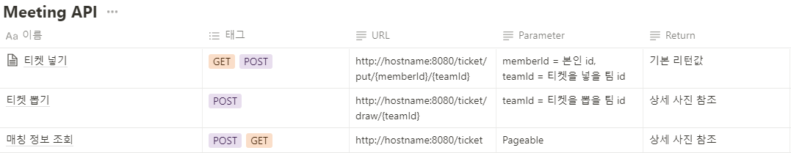

# starting_project
✔⭐ 소셜 로그인(Kakao), 친추 기능, 팀 기능, 과팅 넣기, 뽑기 기능이 있는 서비스
+ Star 팀원들과의 두번째 프로젝트
+ 프론트엔드와 백엔드를 분리하여 개발(협업)
+ 클린 코드, 자바 코드 컨벤션, 객체지향 생활 체조 원칙, 유닛 테스트 코드 작성을 규칙으로 개발

## ⭐Star Team
+ 현재기준 팀 구성(3명)
+ 프론트엔드(2명) : 신건우, 이세민
+ 백엔드(1명) : __임희상__
    

## 개요
+ 명칭 : starting_project
+ 개발 인원 : 프론트(2명), __백엔드(1명, 임희상)__
+ 서비스 기능 : 소셜 로그인(Kakao), 마이 페이지, 친구(요청, 수락, 거절, 삭제), 팀(생성, 인원 추가, 삭제), 과팅(뽑기, 넣기)
+ 개발 환경 : Intellij, Springboot 2.6.7, Java 11, Mysql 8.0, Jpa(Spring Data JPA), SpringSecurity, SpringOauth2Client
+ 형상 관리 툴 : git
+ 협업 툴 : notion
+ 시연 영상 : 프론트 개발 완료 후 추가 예정
    

## 프로젝트를 통해 공부한 것들
+ Oauth2.0 프로토콜
+ Social Login 기능 구현
+ 클린 코드, 자바 코드 컨벤션, 객체지향 생활 체조 원칙, 유닛 테스트 코드 의시적인 연습
    

## API 설계

  
